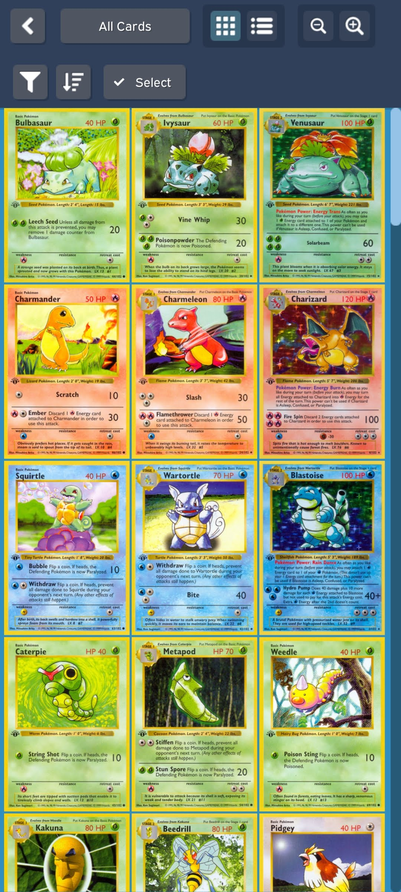
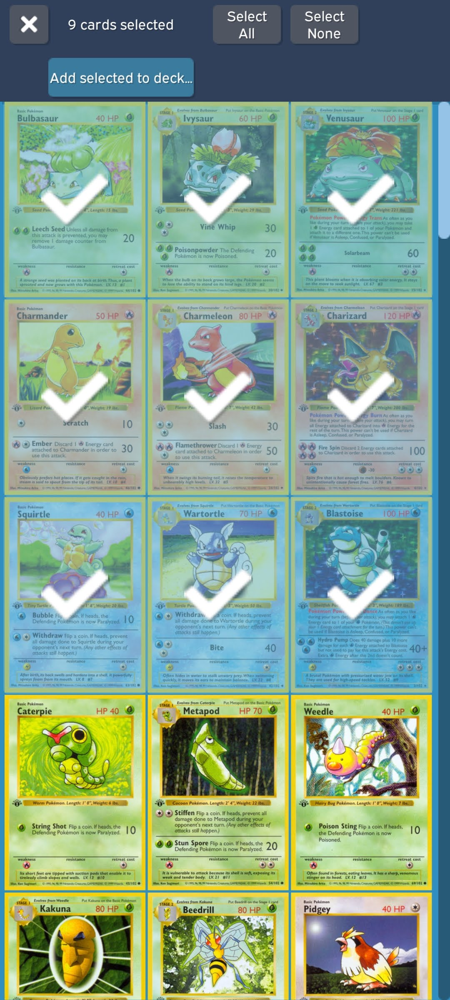
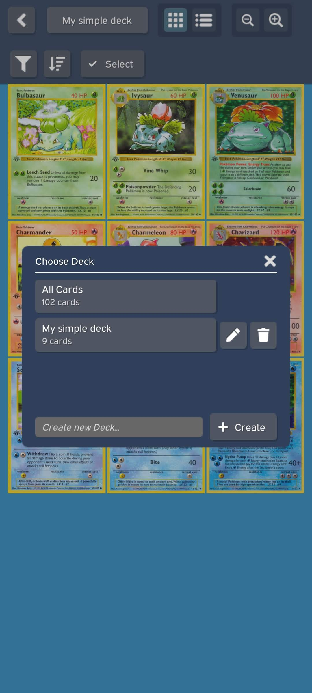
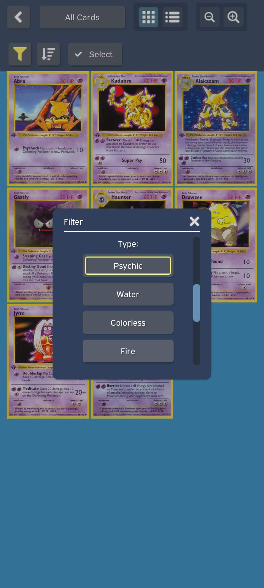

# PkmnDeck
Simple Windows/Android deck builder for Pokemon TCG.

Made as a technical assignment in 5 days for a job interview.

## About
* Browse available Pokemon TCG cards (fetched in realtime from [pokemontcg.io](https://pokemontcg.io/))
* Create own decks and add/remove cards
* Filter/sort cards
* Grid/list view
* Press on card for detailed view and HD image
* UI animations using DOTween
* Currently set to show 1st Gen set only but can be easily changed to any set

   

## Usage

Download ready builds from [Releases](../../releases/tag/1.0).

Made with Unity 2021.2.11f. Upon cloning, you should be able to run immediately in Unity test mode, or build and run.

## License

Distributed under the MIT License. See `LICENSE` for more information.

## Contact

Kostas Ventouras - [@kostasvs](https://github.com/kostasvs)

Project Link: [https://github.com/kostasvs/PkmnDeck](https://github.com/kostasvs/PkmnDeck)
